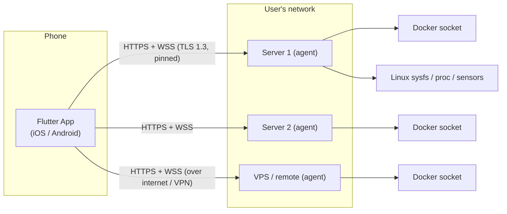
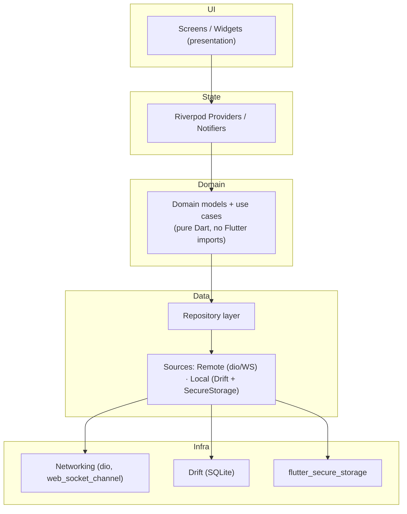
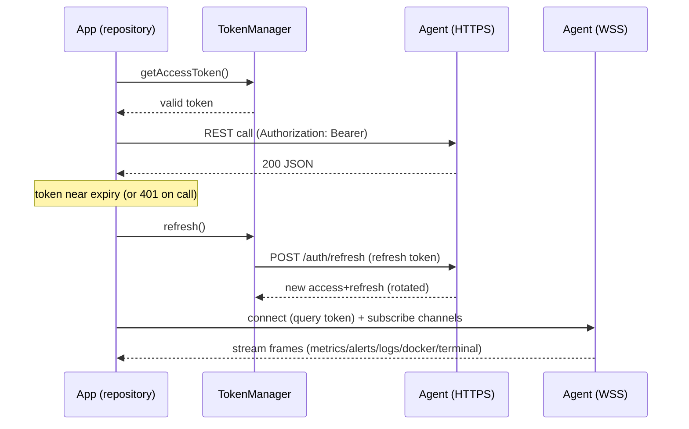
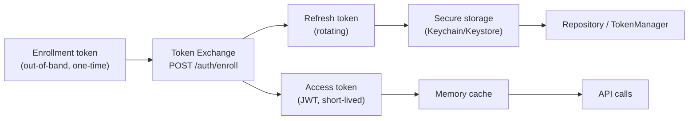
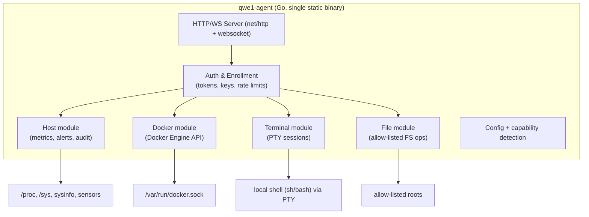

# 09 — System Architecture

**Project:** qwe1
**Status:** `[DECIDED]`
**Owner:** Architecture

---

## 1. Architectural overview

qwe1 is a **two-component, direct-connection system**:

1. **Flutter mobile app** — the client. Multi-server control plane on iOS/Android.
2. **Go agent** — one lightweight, self-contained binary installed on each Linux server.

There is **no cloud, no hub, no relay**. The app maintains a profile per server and connects to each server's agent **directly** over HTTPS (REST) and WSS (realtime). This is the load-bearing decision of the product and everything else follows from it.

**Why direct-connection?**
- **Privacy:** nothing leaves the user's control.
- **Simplicity:** one agent, no infra to operate (fits the "self-hosted forever" principle).
- **Tradeoff (accepted):** alerts cannot be *pushed* to an offline app. Mitigated by agent-side buffering, in-app sync, and optional user-configured webhook/ntfy relays. Push via a user-run relay is on the v2 roadmap.

---

## 2. Flutter app architecture

Layered architecture with **unidirectional data flow**, inspired by clean architecture, adapted to Flutter's idioms. Every layer is explicit and testable.

### 2.1 Layer responsibilities

| Layer | Contents | Rules |
|-------|----------|-------|
| **Presentation** | Widgets, screens, local state (`SC-*` in [08-screens.md](./08-screens.md)) | No business logic; consumes providers |
| **State (Riverpod)** | Notifiers/providers per feature (servers, docker, terminal, alerts, settings) | Single source of truth in app; exposes async values; handles optimistic updates |
| **Domain** | Entities (`Server`, `Container`, `MetricSample`, `Alert`), use cases, repository **interfaces** | Pure Dart; no Flutter imports → unit-testable on host |
| **Data (Repository)** | Implements repository interfaces; decides remote vs local vs cache; offline policy | Single place that touches sources |
| **Sources/Infra** | dio + WS client; Drift DAOs; secure storage wrapper; platform channels (biometrics, notifications, pickers) | No domain logic |

### 2.2 Key principles
- **Repository pattern:** UI never talks to HTTP/DB directly. Enables offline cache + test doubles.
- **Optimistic UI for safe ops:** state updates instantly, reconciled on server response; destructive ops are pessimistic (wait for ack).
- **Offline-first config, online-required ops:** profile edits queue; container/terminal/fs ops require connectivity (documented in [12-database-design.md](./12-database-design.md)).
- **One WebSocket multiplexer** per connected server (channels: `metrics`, `alerts`, `docker`, `logs`, `terminal`) instead of many sockets — fewer connections, ordered delivery per channel.

---

## 3. Networking layer

- **HTTP client:** `dio` with an interceptor chain (auth, retry, rate-limit awareness, error mapping).
- **Realtime:** `web_socket_channel` + a small multiplexer; protocol in [11-api-design.md](./11-api-design.md) §9.
- **TLS:** built on OS trust with **certificate pinning** (agent self-signed CA fingerprint recorded at enrollment; see [14-security-architecture.md](./14-security-architecture.md) §3).
- **API versioning:** every request carries `X-Api-Version`; agent rejects mismatched major versions with `426` (see §6).

---

## 4. Authentication layer (client-side)

- **TokenManager** owns lifecycle: issue from memory, refresh via rotation, persist refresh token only in secure storage.
- On `401`: one silent refresh attempt, then surface "re-authenticate" state.
- Biometric gate wraps app open (SC-19), not individual API calls.
- Full comparison & rationale in [13-authentication.md](./13-authentication.md).

---

## 5. Server agent architecture

- **Single process, no external deps.** Runs as `systemd` unit, `docker run`, or plain binary.
- **Capability detection:** agent reports host features (temp sensors present, docker socket reachable, allowed FS roots) so the app renders only what's supported.
- **Concurrency:** bounded workers for sessions/log streams; backpressure everywhere.
- Full detail in [10-backend-planning.md](./10-backend-planning.md).

---

## 6. Versioning & compatibility

- **Semver** for app and agent.
- **API contract version** (`v1`) in URL + `X-Api-Version` header (major.minor).
- Compatibility matrix:

| Agent \ App | App v1.x | App v2.x |
|-------------|----------|----------|
| Agent v1.x | ✅ v1 API | upgrade agent or bridge |
| Agent v2.x | ✅ (compat layer) | ✅ v2 API |

- On major mismatch the app shows "Update agent/app" rather than failing silently (`426`).
- Paired releases: each app release documents the minimum agent version. (Roadmap: [17-roadmap.md](./17-roadmap.md).)

---

## 7. Security architecture (summary)

| Concern | Approach | Detail |
|---------|----------|--------|
| Transport | TLS 1.3 + cert pinning (agent cert fingerprint) | [14-security-architecture.md](./14-security-architecture.md) §3 |
| Identity | Enrollment token → JWT access (≤15m) + rotating refresh | §4 |
| Storage | Secrets in Keychain/Keystore; SQLite cache never holds secrets | §6 |
| AuthZ | Single operator + per-server read-only; agent-enforced | §7 |
| Hardening | Rate limits, brute-force lockout, audit log, replay protection | §9–11 |
| Mobile | OWASP MAS mapped; biometric gate; secure update via stores | §12 |

## 8. Future scalability hooks (no AI)

- **Plugin model (v3):** the agent exposes typed capabilities; modules (host/docker/fs/terminal) already defined as isolated units → plugins are additional capability modules registered to the same auth/HTTP core.
- **Multi-user RBAC (v2):** auth layer already separates "device identity" from "user role"; adding accounts is additive.
- **Relay mode (v2/enterprise):** direct connection is the default; an optional user-hosted relay for push/offline access plugs in behind the same API contract.
- **K8s/Proxmox (v3):** new agent modules behind the same API.
- **AI (v2 only):** the repository/API boundaries are where an AI layer would integrate (summarize logs/alert triage). Architecture intentionally keeps AI out of the data path in v1.
