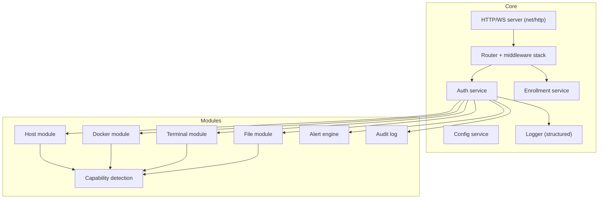

# 10 — Backend Planning

**Project:** qwe1 — Server Agent
**Status:** `[DECIDED]`
**Owner:** Backend

---

## 1. Responsibilities

The agent is the **only** piece of software that runs on the user's server. Its responsibilities:

1. **Serve as the trust anchor** — own TLS identity, enrollment, token issuance.
2. **Expose a secure REST + WebSocket API** for the mobile app (contract in [11-api-design.md](./11-api-design.md)).
3. **Collect host metrics** (CPU, RAM, swap, disk, network, temperature, uptime, load).
4. **Interact with Docker** (list, inspect, lifecycle, logs, stats) via the Docker Engine API.
5. **Provide interactive terminal sessions** (local PTYs over WebSocket).
6. **Provide file operations** strictly within allow-listed roots.
7. **Evaluate alert rules** (thresholds) and buffer events; optionally forward to user-configured webhooks/ntfy.
8. **Record an audit log** of privileged actions.
9. **Enforce security controls** — rate limits, brute-force protection, read-only mode, token lifecycle.

## 2. Design constraints (non-negotiables)

- **Single static binary**, no runtime dependencies beyond the OS kernel and libc (static build; note musl vs glibc for cross-compilation).
- **Runs with least privilege** — never `root` by default; user-configured. Docker access via `docker` group or socket proxy.
- **Small footprint** — target idle RSS < 20MB, negligible CPU when idle.
- **Zero external network calls** except user-configured webhooks. No phone-home, no analytics, no update check (updates via user's own package manager/manual).
- **Configurable and auditable** — YAML config + CLI flags + env vars; `--check` validates config.

## 3. Architecture



**Middleware stack (ordered):**
1. Request ID (correlation id)
2. Access log (debug level)
3. Recovery (panic → 500, no crash)
4. TLS termination (serve TLS; optional plaintext for LAN dev disabled by default)
5. Rate limiting (per-IP, per-token)
6. AuthN (validate bearer/WS token; public routes: status, enroll)
7. AuthZ (route permission + read-only enforcement)
8. Body limits / timeouts / gzip

## 4. Modules

### 4.1 Host module
- **Metrics source:** `github.com/shirou/gopsutil/v3` (cpu, mem, disk, net, load, uptime) + native sysfs reads for temperature (`/sys/class/thermal/thermal_zone*/temp` on Linux; empty elsewhere).
- Collects on a ticker (configurable; default 5s), caches latest snapshot, streams to subscribed clients.
- **Capability detection:** presence of temp sensors, docker socket, allowed FS roots → exposed via `/status`.

### 4.2 Docker module
- **Transport:** official Go Docker client (`github.com/docker/docker/client`) against `/var/run/docker.sock` (or `DOCKER_HOST` override).
- Handles socket permission errors gracefully → surfaces "docker unavailable" capability.
- Operations: `list`, `inspect`, `start/stop/restart/pause/unpause/kill/remove`, `logs` (tail + stream), `stats` (bounded rate), `events` (filtered: state changes).
- **Security:** no shell interpolation; all args passed via typed client methods. Container actions gated by read-only mode.

### 4.3 Terminal module
- **PTY:** `creack/pty`; spawns the configured default shell (`$SHELL`, fallback `/bin/sh`) in an isolated session (setsid, new session leader, `HUPCL`).
- **WS protocol:** binary frames for output, JSON control frames for resize/close. Backpressure: if the client stalls, the agent pauses reads; bounded per-session buffers.
- **Concurrency limit:** configurable max sessions (default 4); excess → 429.
- **Session registry:** sessions survive brief client disconnects (configurable, default 60s) for reattach; force-close API kills the PTY and process group.

### 4.4 File module
- **Allow-list roots** only (default: `$HOME`, `/srv`, `/var/lib/docker` — each individually configurable; default **off** unless enabled).
- All path resolution normalized with `filepath.Abs` + prefix check (symlink-resolved) → traversal rejected with 403.
- Operations: list, read (bounded, text/image), write/create, rename, delete (respecting OS permissions), upload with size caps and streaming.
- **Hidden files** excluded by default (configurable).

### 4.5 Alert engine
- Rule types: host (cpu, mem, swap, disk, temp) + docker (container down/restarting) + host-down (evaluated by client-side timer too).
- Threshold semantics: value + duration (debounce), e.g. `cpu > 90% for 60s`.
- On trigger: record alert (persisted to agent's own small store or in-memory with WAL), push to subscribed WS clients, optionally forward to webhook/ntfy.
- Alerts have `ack` state synced with the app.

### 4.6 Audit log
- Records privileged actions: enroll, auth events, container mutations, terminal session create/kill, file deletions, config changes.
- Fields: `ts, actor(tokenId), action, target, result, ip`. Bounded ring (configurable), exposed read-only to the app.

## 5. Technology choices

| Concern | Choice | Reasoning |
|---------|--------|-----------|
| Language | **Go (1.22+)** | Single static binary, superb concurrency for streams/PTYs, trivial cross-compile for armv7/arm64/amd64, huge ecosystem, memory safety |
| HTTP | **`net/http` (stdlib) + `http.ServeMux`** (Go 1.22 pattern routing) | Zero-dependency, fast, sufficient; avoids framework lock-in |
| WebSocket | **`github.com/nhooyr/websocket`** (now `github.com/coder/websocket`) | Clean, context-aware, well-maintained; gorilla is fine but coder is preferred for correctness |
| Docker | **`github.com/docker/docker/client`** | Official client |
| PTY | **`github.com/creack/pty`** | Standard for PTY spawning |
| Metrics | **`github.com/shirou/gopsutil/v3`** + native sysfs temperature reads | Cross-platform host metrics, active maintenance |
| Config | **YAML** (`gopkg.in/yaml.v3`) + flags + env | Human-editable for a self-hosted tool |
| Logging | **`log/slog`** (stdlib structured logging) | Standard, low-dep |
| Metrics export | **Prometheus format** via `/metrics` (optional toggle) | Interop with user's existing monitoring |
| Notifications | Plain HTTPS webhook + **ntfy** JSON push (user-configured) | Keeps alerting independent of the app |

## 6. Security (agent-side summary)

- TLS 1.3 (min 1.2); self-signed cert + CA generated at first run; fingerprint shown during enrollment.
- Tokens: short-lived JWT access (RS256, key on agent), rotating refresh; no external identity dependency.
- Rate limiting + brute-force lockout on enroll/auth.
- Read-only mode enforced **in middleware**, not just in UI.
- Path traversal protection, body limits, WS frame limits, concurrency caps.
- Runs as unprivileged user; config validation `--check`; no secrets in config (tokens are generated/printed).
- **Full model:** [14-security-architecture.md](./14-security-architecture.md).

## 7. Logging & monitoring

- Structured `slog` JSON logs to stdout/journald; `-log-level=debug|info|warn|error`.
- Optional `/metrics` Prometheus endpoint (toggle, default off) + optional `/healthz`.
- Never log tokens, secrets, or file contents.

## 8. Configuration

Minimal, validated YAML (`/etc/qwe1-agent/config.yaml`). Precedence: file < env (`QWE1_LISTEN`, `QWE1_CONFIG_DIR`, `QWE1_READ_ONLY`, `QWE1_LOG_LEVEL`) < CLI flags (`--listen`, `--config-dir`, `--read-only`, `--log-level`). Missing `tls.cert`/`tls.key` are auto-generated under `config_dir` (`certs/server.crt`, `certs/server.key`).

```yaml
listen: "0.0.0.0:9443"
tls:                          # optional; auto-generated under config_dir if absent
  cert: "/etc/qwe1-agent/certs/server.crt"
  key: "/etc/qwe1-agent/certs/server.key"
auth:
  token_ttl: "15m"            # access JWT lifetime, max 1h
  refresh_token_ttl: "720h"   # rotation lifetime
  enrollment_ttl: "10m"       # one-time QR/CLI token lifetime, max 1h
  max_devices: 8
  brute_force: {max_attempts: 5, window: "10m", lockout: "30m"}
docker: {enabled: true}
files:
  roots: ["$HOME", "/srv"]    # allow-listed roots; empty disables the module
  hidden: false
  max_read_bytes: 2097152
alerts:
  rules:
    cpu_percent: {value: 90, for_seconds: "60s"}
    mem_percent: {value: 90, for_seconds: "60s"}
    disk_percent: {value: 85, for_seconds: "5m"}
    temp_celsius: {value: 75, for_seconds: "5m"}
  container: {container_down: true}
  webhook: ""                 # optional alert forwarder
  ntfy_url: ""                # optional alert forwarder
audit: {size: 1000}
log: {level: "info"}
read_only: false
```

### 8.1 CLI

| Command | Purpose |
|---------|---------|
| `qwe1-agent` | Run the server (foreground). |
| `qwe1-agent --check` | Validate config and exit. |
| `qwe1-agent --print-config` | Print the effective config (derived TLS paths resolved). |
| `qwe1-agent --version` | Print version. |
| `qwe1-agent enroll` | Generate a one-time enrollment token + QR for the app to scan (docs/05 §3). |
| `qwe1-agent enroll --revoke-all` | Revoke every enrolled device (docs/14 §9). |

Generated state lives under `config_dir`: `signing.pem` (agent RSA identity), `data.json` (hashed refresh/enrollment tokens + device registry, atomically written), `certs/` (self-signed CA + leaf). `data.json` is re-read on access so tokens issued by the `enroll` CLI while the agent is running are picked up.

## 9. Deployment

| Path | Command |
|------|---------|
| Script (Debian/Ubuntu/Fedora/Alpine) | `curl -fsSL https://get.qwe1.sh | sh` → installs binary + systemd unit, non-root `qwe1` user |
| Docker | `docker run -d --name qwe1-agent --restart unless-stopped -v /var/run/docker.sock:/var/run/docker.sock -p 9443:9443 qwe1/agent` |
| Manual | download static binary, run `qwe1-agent --config /path` |

- **systemd unit:** `After=network-online.target`, `Restart=on-failure`, `NoNewPrivileges`, `PrivateTmp`, read-only root where possible, `User=qwe1`.
- **Upgrades:** user-managed (package/script/Docker pull). Agent never self-updates (security + user control).
- **Proxy note:** can sit behind a reverse proxy/Caddy/Traefik; fingerprint pinning still works against upstream TLS if passthrough, or disable app pinning only with explicit user opt-out (not default).

## 10. Agent testing (summary)

- Unit tests: auth, path normalization, alert rules, token lifecycle.
- Integration tests: spin real docker socket (testcontainers-style), real PTY, real fs on tempdirs.
- Security tests: fuzzing of path/input, rate-limit behavior, token rotation, TLS handshake pinning.
- Full detail in [19-testing-strategy.md](./19-testing-strategy.md).
